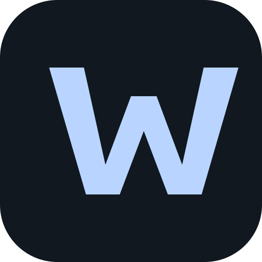
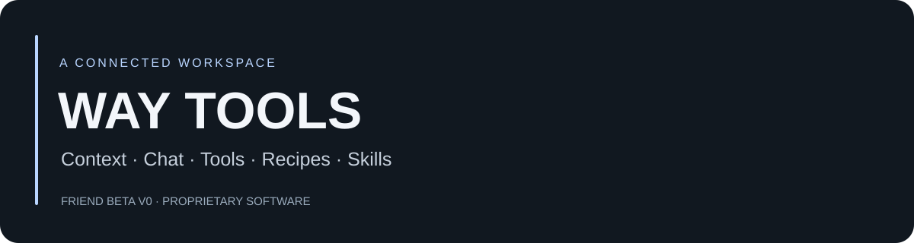
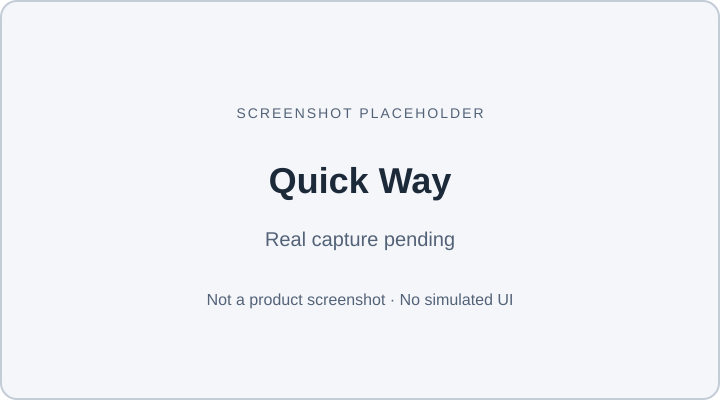
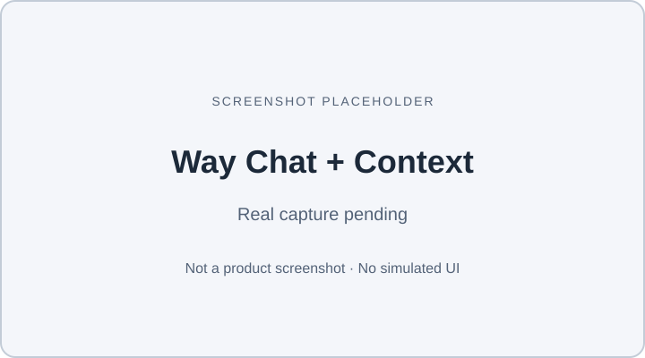
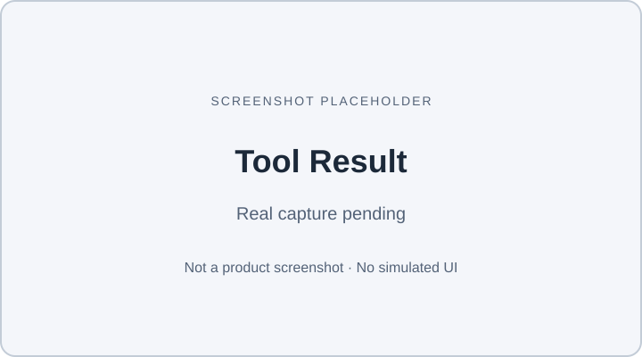
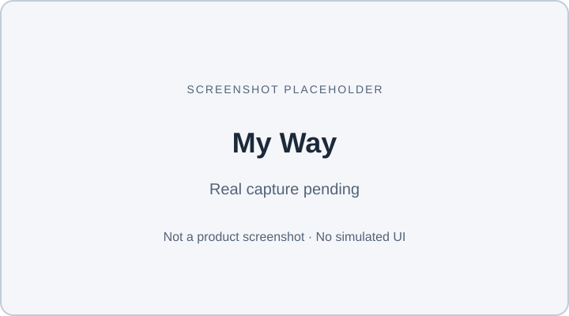
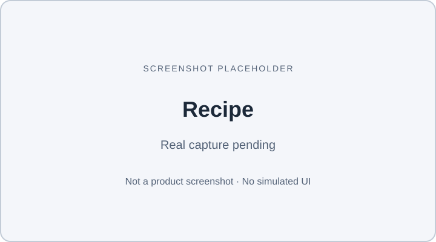
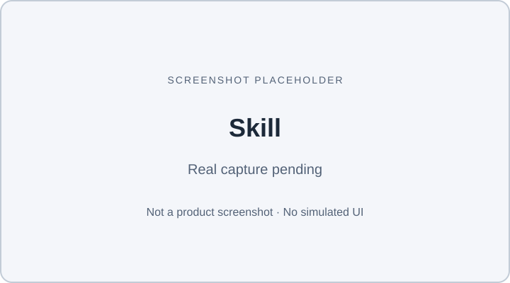

<a href="README.md">English</a> | <a href="README.zh-TW.md">繁體中文</a>

<h1 align="center">WAY TOOLS</h1>

<strong>Less AI. Better System.</strong>

<strong>把一次成功，變成下一次幾乎免費的能力。</strong>

需要 AI 時才用 AI，把成功且驗證過的方法留下來，讓熟悉任務逐步用更少推理、更少 Token，甚至更多本機能力完成。

<strong>Friend Beta V0</strong> · 私人受邀測試 · 專有軟體

<a href="docs/getting-started.md#繁體中文快速路線">從這裡開始</a> · <a href="docs/installation.md">安裝</a> · <a href="#目前可用">目前可用</a> · <a href="#產品方向--vision">產品方向</a> · <a href="docs/feedback.md">回饋</a> · <a href="https://waytools.pages.dev/">官方網站</a>

## Way Tools 是什麼？

Way Tools 把 Context、Way Chat、Tools、Recipes 與 Skills 放在連貫的工作空間。先提供文字或頁面資訊，再下已支援的指令或選工具，查看結果，最後把有用的內容留在 My Way。

Chrome 擴充功能從 **Quick Way** 開始，讓你在瀏覽網頁時快速帶入資料。按 **「開啟 Way Tools」** 就能進完整工作區；Web 則直接開完整介面。

> **早期測試版：** Way Chat 目前執行已支援的本機指令，尚未啟用遠端 AI，無法像一般 AI 聊天服務回答任意問題。Friend Beta 套件只私下提供給少量可信測試者，這裡沒有公開下載。

## 為什麼使用 Way Tools？

多數 AI 產品會把每個任務都變成下一次推理。Way Tools 的方向不同：需要時使用 AI，保留成功且驗證過的方法，並把重複出現的熟悉工作逐步轉成可重用的本機或確定性能力。

- **先從資料開始。** 明確附加頁面資訊或選文，也可以貼上簡單範例。
- **在聊天與工具之間接續操作。** 用指令或工具按鈕處理，再把結果傳回 Chat。
- **把有用的內容放在一起。** My Way 保存本機筆記、Recipe 結果與 Skills。
- **重複成功的方法。** 跑完 Clean & Save Links，把已驗證的方法另存為 Skill，下次提供新輸入再使用。

## 目前可用

Friend Beta V0 目前刻意維持有限、以本機為主的範圍。

| 項目 | 狀態 |
| --- | --- |
| 產品 | Friend Beta V0；應用程式版本 0.1.15 |
| 平台 | Web 工作區、私下提供的桌面 Chrome 擴充功能 |
| 聊天 | 已支援本機指令；未啟用遠端 AI |
| Recipes／Skills | 一個內建 Recipe，可保存成功方法並用新輸入重跑 |
| 資料 | 本機工作區；沒有帳號、雲端或跨平台同步 |
| 下一版本 | V0.1.16 尚未開始 |

下方 **產品方向 / Vision** 的內容是長期產品方向，不代表目前 Friend Beta 已經提供這些功能。

## 現在怎麼使用

| 步驟 | 你要做什麼 | 範例 |
| --- | --- | --- |
| Context／脈絡 | 提供這次處理的資料 | 公開示範網址或短文字 |
| Chat／Tool | 下已支援的指令或選工具 | 保存筆記、轉換大小寫 |
| Action／操作 | 執行選定的動作 | 在文字工具箱按「轉成大寫」 |
| Result／結果 | 查看輸出 | 在「最近結果」看到 WAY BETA |
| Recipe／Skill | 需要時重複既有程序 | 整理連結、保存方法、用新連結再跑 |

聊天和工具是不同的起點；每個任務不用經過所有畫面。

## 主要體驗

| 體驗 | 可以做什麼 | 說明 |
| --- | --- | --- |
| **Quick Way** | 帶入瀏覽器脈絡、送出簡單指令、開完整擴充功能 | [Quick Way](docs/quick-way.md) |
| **Context／脈絡** | 確認操作使用哪段文字、頁面資訊或工具輸入 | [使用 Context](docs/context.md) |
| **Way Chat** | 用短指令執行已支援的本機操作 | [Chat 與 Tools](docs/chat-and-tools.md) |
| **Tools／工具** | 使用文字工具箱、JSON 格式整理、圖片壓縮等工具 | [Chat 與 Tools](docs/chat-and-tools.md) |
| **My Way** | 找筆記、已釘選／最近使用工具、Recipe 結果與 Skills | [Recipes 與 Skills](docs/recipes-and-skills.md) |
| **Recipes** | 執行內建 Clean & Save Links 程序 | [Recipes 與 Skills](docs/recipes-and-skills.md) |
| **Skills** | 保存成功 Recipe 的方法，下次用新輸入重跑 | [Recipes 與 Skills](docs/recipes-and-skills.md) |

## 產品方向 / Vision

### 產品哲學

Way Tools 的目標不是讓 AI 呼叫越多越好。長期系統應先把正確資料捕捉進來，先保留結構，再決定是否需要生成；而且在再次呼叫 AI 前，先回想系統已經知道什麼。也就是：**先 Capture，再決定需要多少智慧；先 Recall，再考慮 AI；Structured IR First；沒有變化的 Context 不重送。** AI 應該只補本機邏輯與已驗證知識無法可靠填補的語意缺口。

成功的 AI 工作，應該逐步畢業成 Local / Deterministic Capability。Skills、Recipes 與各種能力也應越來越「隱性」：面對熟悉任務，使用者不需要先想起某個 Skill 名稱再手動打開。互動應該是 **Intent-first，而不是 Tool-first**；工具分類與標籤只是輔助 UI，只有在真的有幫助時才出現。

這個方向可以濃縮成一句：**Less AI. Better System.**

### 長期循環

**Capture → Local Process → Context → Recall → Route → Act → Verify → Learn**

驗證過的結果，接著可以進入另一個正向循環：

**Capability Memory → Reuse → Cost Down**

**Capability Memory（能力記憶）**不是只記住內容，而是記住「某一類任務曾經如何成功完成」：包含可重用步驟、已驗證方法，以及能穩定執行的確定性能力。這讓下一次遇到相似任務時，可以少一點推理、少一點 Token，最後甚至不必再呼叫 AI。

### 正向飛輪

**第一次使用 → AI / 推理 → 成功且驗證 → 記住方法 → 重複使用 → Skill / Recipe / Capability → 成熟使用 → Local / Deterministic 執行 → 更快 + 更便宜 + 更少依賴 AI**

理想結果不是「更多 AI calls」，而是每一次成功使用，都讓下一次類似工作更便宜、更快，也更少依賴 AI。

### Recall before AI

未來的 Way Tools Router 在呼叫 AI 前，應先檢查已經存在的能力與記憶，包括：

- 既有 Skills
- Recipes
- Local Capabilities
- Capability Memory
- 過去已驗證的工作流程
- 與當前任務相關的使用者／Context 記憶

概念路徑：

**Intent → Recall → 已知能力？**

- **完全或高信心匹配：** 直接在本機重用。
- **部分匹配：** 先重用已知部分，只補真正缺少的語意。
- **沒有可靠匹配：** 再使用 AI。

這種路由模式、自動 Skill Recall、隱性 Skills、Capability Memory、AI Dependency 降低，以及逐步轉成 Local / Deterministic 的機制，都屬於 **產品方向 / Vision**，不是 Friend Beta V0 已上線功能。

## 產品畫面

以下是明確標示的截圖預留位置，並未模擬產品介面。實際畫面會在隱私審查後補入。

| Quick Way | Way Chat + Context |
| --- | --- |
|  |  |
| 工具結果 | My Way |
|  |  |
| Recipe | Skill |
|  |  |

## 約 5 分鐘開始使用

安裝完成後，只用非敏感範例：

1. 在 example.com 打開擴充功能 **Quick Way**，按 **「傳送目前頁面」**。
2. 在 Way Chat 輸入 **「記住」**，將剛附加的頁面資訊保存成筆記。
3. 按 **「開啟 Way Tools」** → **「文字工具箱」**，輸入 **way beta**，按 **「轉成大寫」**。
4. 查看輸出 **WAY BETA**。「傳送到 Chat」可帶入結果，再由你決定下一個指令。
5. 選做：跑 **Clean & Save Links**，將成功的方法另存為 Skill，再用新輸入重跑。

[逐步入門](docs/getting-started.md#繁體中文快速路線) 包含 Web 替代流程與示範網址。5 分鐘是入門設計目標，尚非實測數據；首次安裝需另留時間。

## Friend Beta 狀態

Friend Beta V0 是約 **3–10 位可信測試者**的受控早期測試，目的是了解第一次使用是否清楚、操作是否順暢。私人測試包已準備完成，並通過擁有者實機安裝確認。

受邀者私下收到核准套件，再依 [安裝說明](docs/installation.md) 操作。請勿公開分享、上傳或轉貼套件。本文件 repository 不提供公開產品發行或下載。

## 安全與隱私

建議使用 **獨立瀏覽器設定檔**，只放 **非敏感測試資料**。不要放入密碼、API keys、登入驗證秘密、付款資訊、私人醫療紀錄、機密工作資料或敏感個人文件。

資料保存在本機，Web 與擴充功能各自獨立；沒有帳號或雲端同步。同一設定檔的其他使用者可能看見資料，目前測試版沒有正式多使用者安全隔離。

開始前先讀 [安全規則](docs/safety.md)。截圖與除錯摘要送出前，請自行檢查內容。

## 文件導覽

深層文件目前以英文為主；入門、安裝與安全文件附繁體中文重點，操作標籤也提供中英對照。

| 開始 | 使用 | 求助 |
| --- | --- | --- |
| [快速入門](docs/getting-started.md#繁體中文快速路線) | [Quick Way](docs/quick-way.md) | [安全](docs/safety.md) |
| [安裝](docs/installation.md) | [Context](docs/context.md) | [已知問題](docs/known-issues.md) |
| [Web 替代](docs/getting-started.md#web-route) | [Chat 與 Tools](docs/chat-and-tools.md) | [疑難排解](docs/troubleshooting.md) |
| [Getting Started](docs/getting-started.md) | [Recipes 與 Skills](docs/recipes-and-skills.md) | [回饋](docs/feedback.md) |

## 回饋與 Issues

告訴我們你想做什麼、預期什麼、實際發生什麼，以及能否繼續使用。英文或繁體中文都可以。

已準備 **Bug Report**、**UX / Confusing Flow**、**Feature Request** 三種表單。此 repository 發布並啟用 Issues 後，可從 Issues 分頁填寫；在此之前，受邀者仍透過原本與擁有者的私人聯絡管道回報。[回饋說明](docs/feedback.md)。

GitHub Issues 是公開的。先移除秘密與私人內容，不要附完整工作區或私人測試包。

## 目前狀態

請以上方 **目前可用** 為準；UX 與相容性限制請看 [已知問題](docs/known-issues.md)。

## 原始碼提供範圍

Way Tools 是專有軟體，維持閉源。本 repository 只包含公開文件、產品資訊與測試說明，並不提供 Way Tools 應用程式原始碼。

Repository 公開可見不代表取得專有 Way Tools 軟體的權利。詳見 [專有權利聲明](PROPRIETARY-NOTICE.md)。

## 官方網站

Way Tools 官方網站：[waytools.pages.dev](https://waytools.pages.dev/)。網站是 Web 工作區，造訪網站不會安裝 Quick Way，也不會同步擴充功能資料。
